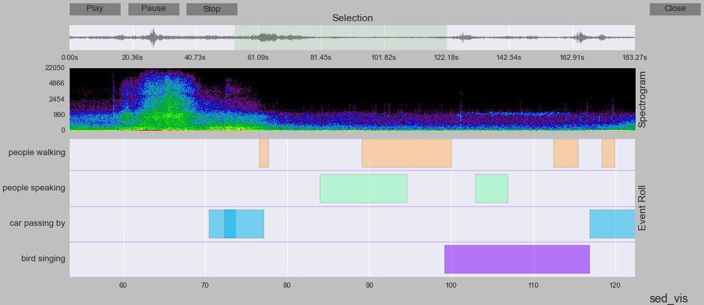

``sed_vis`` - Visualization toolbox for Sound Event Detection
=============================================================



``sed_vis`` is an open source Python toolbox for visualizing the annotations and system outputs of sound event detection systems.

There is an *event roll*-type of visualizer to show annotation and/or system output along with the audio signal. The audio signal can be played and indicator bar can be used to follow the sound events. 

The visualization tool can be used in any of the following ways:

* By using the included visualizer script directly. This is suitable users who do not normally use Python.
* By importing it and calling it from your own Python code

Installation instructions
=========================

Easiest way to install is to use ``pip``:

    git clone https://github.com/TUT-ARG/sed_vis.git
    pip install -e sed_vis

To uninstall:

    pip uninstall sed_vis

To install from source using ``setup.py``, first install the dependencies:

``pip install -r requirements.txt``

and then run:

``python setup.py install``

To uninstall the toolbox:

``python setup.py install --record files.txt`` to get files associated with toolbox

``cat files.txt | xargs rm -rf`` to remove the files recorded by the previous step.


You can also install the toolbox in develop mode:

``python setup.py develop``

Toolbox can be uninstalled:

``python setup.py develop --uninstall``

Requirements
------------

The toolbox is tested with Python 2.7.10. 

* numpy >= 1.7.0
* scipy >= 0.9.0
* matplotlib >= 1.4.0
* pyaudio >= 0.2.7
* dcase_util >= 0.1.5

*Mac*

In order to toolbox work with Mac, matplotlib need to use TkAgg backend. The toolbox will automatically try to set appropriate backend. 

Quickstart: Using the visualizer
================================

The easiest way to visualize sound events with ``sed_vis`` is to use provided visualizer script.

Visualizers are Python scripts which can be run from the command prompt and utilize ``sed_vis`` to visualize reference and estimated annotations you provide. 
To use the visualizers, you must first install ``sed_vis`` and its dependencies.
The visualizers scripts can be found in the ``sed_vis`` repository in the ``visualizers`` folder:

https://github.com/TUT-ARG/sed_vis/tree/master/visualizers

Currently there is one visualizer available, which is visualizing events as *event roll*.

To get usage help:

``./sed_visualizer.py --help``

To visualize reference and estimated annotations along with audio:

``./sed_visualizer.py -a ../tests/data/a001.wav -l ../tests/data/a001.ann ../tests/data/a001_system_output.ann -n reference system``

Where argument ``-l ../tests/data/a001.ann ../tests/data/a001_system_output.ann`` gives list of event lists to be visualized and argument ``-n reference system`` gives name identifiers for them.

This will show window with three panels: 

1. Selector panel, use this to zoom in, zoom out by clicking 
2. Spectrogram or time domain panel
3. Event roll, event instances can be played back by clicking them

To visualize only reference annotation along with audio:

``./sed_visualizer.py -a ../tests/data/a001.wav -l ../tests/data/a001.ann -n reference``

To visualize only reference annotation along with audio, with only certain sound event labels visible:

``./sed_visualizer.py -a ../tests/data/a001.wav -l ../tests/data/a001.ann -n reference -e "bird singing" "car passing by"``

To visualize only reference annotation along with audio using only time domain representations:

``./sed_visualizer.py -a ../tests/data/a001.wav -l ../tests/data/a001.ann -n reference --time_domain``

To visualize only reference annotation along with audio, and merging events having only small gap between them (<100ms):

``./sed_visualizer.py -a ../tests/data/a001.wav -l ../tests/data/a001.ann -n reference --minimum_event_gap=0.1``

To prepare visuals for publication. This will remove all audio playback buttons and tighten the layout. Also font size is increased. Use figure save button to save figure in svg format. One can use Inkscape to edit figure further and save into eps-format.

``./sed_visualizer.py -a ../tests/data/a001.wav -l ../tests/data/a001.ann -n reference --publication``

Quickstart: Using ``sed_vis`` in Python code
=============================================

After ``sed_vis`` is installed, it can be imported and used to your Python code as follows:

```python
import sed_vis
import dcase_util

# Load audio signal first
audio_container = dcase_util.containers.AudioContainer().load(
    'tests/data/a001.wav'
)

# Load event lists
reference_event_list = dcase_util.containers.MetaDataContainer().load(
    'tests/data/a001.ann'
)
estimated_event_list = dcase_util.containers.MetaDataContainer().load(
    'tests/data/a001_system_output.ann'
)

event_lists = {
    'reference': reference_event_list, 
    'estimated': estimated_event_list
}

# Visualize the data
vis = sed_vis.visualization.EventListVisualizer(event_lists=event_lists,
                                                audio_signal=audio_container.data,
                                                sampling_rate=audio_container.fs)
vis.show()
```

License
=======

Code released under [the MIT license](https://github.com/TUT-ARG/sed_vis/tree/master/LICENSE.txt). 